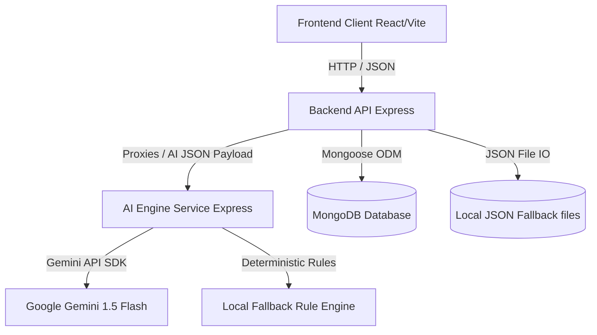

# System Architecture - AI LMS Automation Engine

This document outlines the high-level system architecture and system integration flow of the EduFlick AI LMS Automation Engine.

---

## Architecture Overview

The system is designed as a modular, three-tier architecture comprising:
1. **Frontend Client**: A responsive Single Page Application (SPA) built using Vite, React, Tailwind CSS, and Chart.js/Recharts.
2. **Backend API Gateway**: An Express service managing user authentication, course administration, progress tracking, and database synchronization.
3. **AI Engine Microservice**: An independent service dedicated to generating personalized learning roadmaps, analyzing progress patterns, and providing conversational chatbot guidance.

---

## Microservices Breakdown

### 1. Frontend Client (Port `5173`)
- **Key Frameworks**: React 19, React Router v7, Tailwind CSS v4, Lucide React, Recharts.
- **Role**: Presents dashboards, course modules, custom maps (learning path stages), and a floating chatbot drawer. Communicates exclusively with the Backend API.

### 2. Backend API Gateway (Port `5000`)
- **Key Frameworks**: Express, Mongoose, jsonwebtoken, bcryptjs, cors.
- **Role**: Coordinates user operations (auth, profiles), courses, and lessons progress tracking. Serves as a gateway/proxy to the AI engine for learning paths and chatbot logic. Handles DB connections and supports fallback file storage.

### 3. AI Engine Service (Port `8000`)
- **Key Frameworks**: Express, @google/generative-ai, cors, dotenv.
- **Role**: Listens for payloads describing student profiles, tracks, interests, and progress. It evaluates these metrics and produces formatted recommendations.
- **Hybrid Operations**:
  - **Online Mode**: When `GEMINI_API_KEY` is loaded, it accesses `gemini-1.5-flash` using custom curriculum-structuring prompts.
  - **Offline/Local Mode**: Acts as a local deterministic rule-based expert engine if the API key is not supplied, sorting and parsing catalog items to maintain 100% features functionality.

---

## Port Configurations and Environment Variables

### Backend `.env` Settings
- `PORT=5000`
- `MONGO_URI=mongodb://127.0.0.1:27017/ai-lms`
- `JWT_SECRET=supersecretkey_lms_engine_eduflick`
- `AI_ENGINE_URL=http://127.0.0.1:8000`

### AI Engine `.env` Settings
- `PORT=8000`
- `GEMINI_API_KEY=your_gemini_key_here`
