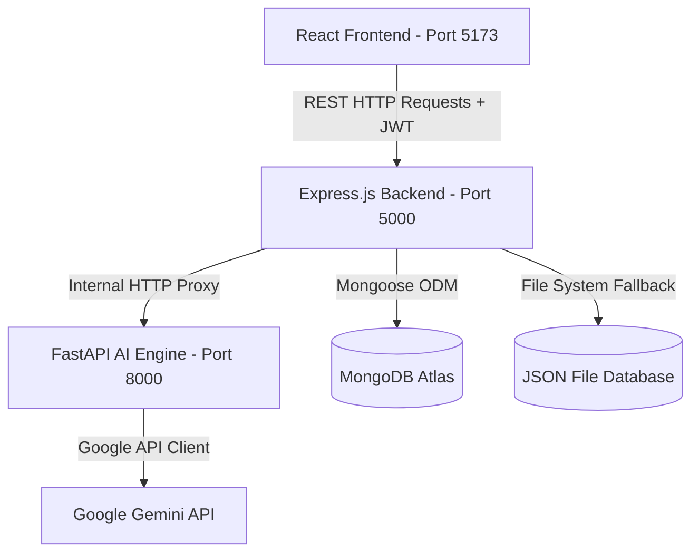

# System Architecture - EduFlick AI LMS Automation Engine

This document explains the technical architecture, communication patterns, and system design of the AI Powered LMS Automation Engine.

---

## 🛠️ Architecture Overview

The platform uses a **three-tier microservices architecture** designed for high modularity, easy scaling, and fault tolerance:

### 1. Frontend Layer (React & Vite)
*   Communicates with the backend server via an Axios instance using base routing.
*   Authenticates requests by sending a JSON Web Token in the `Authorization: Bearer <TOKEN>` header.
*   Utilizes a global AuthContext wrapper that holds states, making tokens and account information accessible in any page.
*   Renders a fluid UI with dark-theme configurations, custom glassmorphism parameters, and custom SVGs.

### 2. Backend Server Layer (Node.js & Express)
*   Exposes endpoints to client requests (Auth, Users, Courses, Progress, AI).
*   Coordinates token authentication using custom verify middlewares.
*   Includes a dual-mode database service wrapper. If MongoDB isn't running, it triggers a local JSON file-system storage mode in the `backend/data/` folder, allowing zero-config local runs.
*   Proxies and structures payloads sent to the python AI microservice.

### 3. AI Personalization Layer (Python & FastAPI)
*   Runs a lightweight FastAPI server listening on port `8000`.
*   Acts as the intelligent recommender. It checks for a `GEMINI_API_KEY` configuration. If active, it prompts the Gemini API with structured instructions to return JSON arrays representing personalized paths, chatbot replies, or student progress analyses.
*   If the Gemini API key is missing or calls fail, it automatically defaults to rule-based python matching algorithms, ensuring reliable performance.

---

## 🔒 Security Design
*   **Password Hashing**: User passwords are encrypted on the database using a 10-salt rounds Bcrypt algorithm.
*   **Session Management**: Access tokens are signed using a secure JWT token on logins and registrations, expiring in 30 days.
*   **Authorization Controls**: Restricts course creations, modifications, and deletions using role check validation middleware (`student` vs `admin`).
