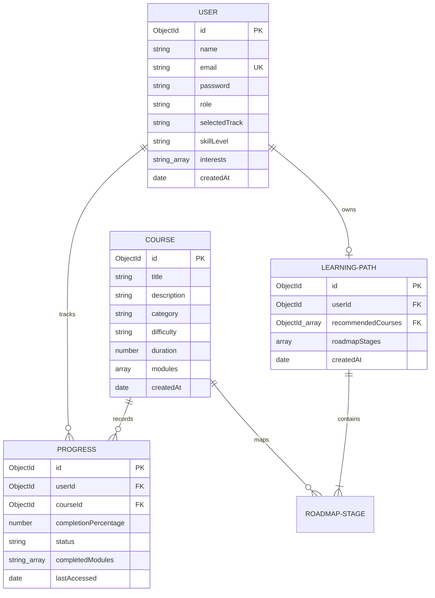

# Database Design - AI LMS Automation Engine

This document details the MongoDB schemas, models, and relationships used by the EduFlick AI LMS.

---

## 🗄️ Database Models

---

## 📝 Schemas Description

### 1. User Model (`User.js`)
Stores user accounts. Password fields are marked with `select: false` to prevent accidental credential leakage in server returns.
*   `role`: Restricts operations to `student` or `admin`.
*   `selectedTrack` & `skillLevel`: Drives the AI personalization engine logic.

### 2. Course Model (`Course.js`)
Maintains the LMS syllabus curriculum items.
*   `modules`: Sub-document array storing specific sub-topics, descriptions, and durations (in minutes).

### 3. Progress Model (`Progress.js`)
An associative table holding student completion statistics for enrolled courses.
*   `completedModules`: Stores titles of completed course modules.
*   `completionPercentage`: Automatically calculated as: `(completedModules.length / course.modules.length) * 100`.
*   `status`: Automatically toggled as `Not Started`, `In Progress`, or `Completed` based on the percentage metric.

### 4. Learning Path Model (`LearningPath.js`)
Caches the AI-generated roadmap structures.
*   `roadmapStages`: Nested array displaying the recommended phases.
*   `courses`: Array of Course references linked to each study phase.
