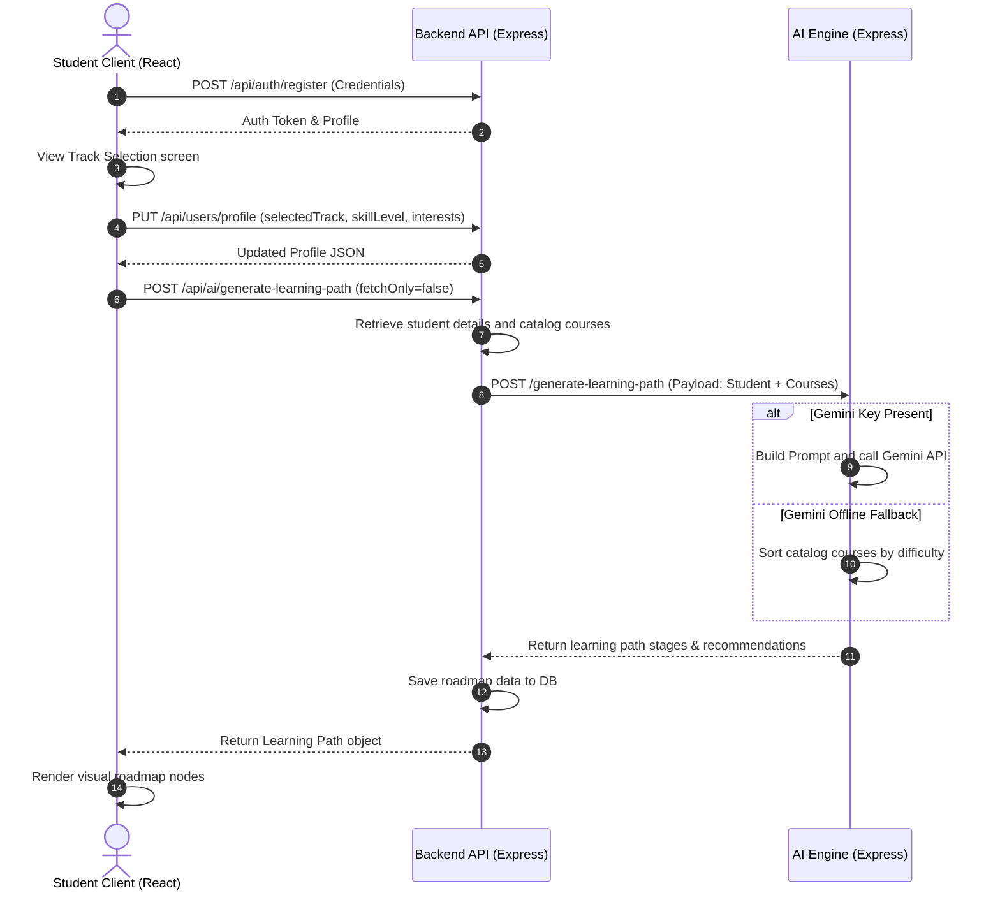

# System Workflows - AI LMS Automation Engine

This document describes the key functional workflows of the EduFlick AI LMS Automation Engine, detailing interactions between the student client, backend service, and AI engine microservice.

---

## Workflow 1: User Onboarding and Track Selection

This flow describes how a student selects a career track and skill level, prompting the generation of their personalized roadmap.

---

## Workflow 2: Course Enrollment and Progress Tracking

This flow traces how a student accesses recommended courses, completes modules, and triggers progress analytics updates.

1. **Course Access**: The student views the **Dashboard** which reads the custom `learningPath` and displays the list of recommended courses.
2. **Lesson Interaction**: The student clicks on a course card to open the **Course Detail** page.
3. **Module Completion**:
   - The student toggles a checkbox or clicks "Complete Lesson" next to a module.
   - The client sends a request to the backend:
     `PUT /api/progress/:courseId` (with body `{ completedModules: [...] }`).
   - The backend retrieves the course to count the total modules, calculates the completion percentage (`(completedModules.length / total) * 100`), updates the status (`Not Started`, `In Progress`, or `Completed`), and persists the progress record.
4. **Analytics Refresh**: When the student navigates to the **Progress Analytics** tab, the frontend requests `POST /api/ai/analyze-progress`.
   - The backend aggregates course completion rates and forwards them to the AI Engine.
   - The AI Engine compiles a textual analysis detailing the student's learning strengths, weaknesses, and next-step actions, displaying it as a premium progress dashboard report.

---

## Workflow 3: Chatbot Helper Conversations

This flow details how the student interacts with the floating chat assistant for real-time guidance.

1. **Interaction Start**: The student opens the chat bubble and types a question, such as *"How should I start learning Python?"*.
2. **Payload Construction**: The client posts the message and local message history to the backend:
   `POST /api/ai/chat` (Payload: `{ message, chatHistory }`).
3. **Context Enrichment**: The backend retrieves the student's profile (track, skill level) and a string summarizing their current course progress, and forwards it to the AI Engine:
   `POST /chat` (Payload: `{ message, studentName, track, skillLevel, interests, progressSummary, chatHistory }`).
4. **Response Generation**:
   - The AI Engine constructs a prompt embedding the student's academic context and previous chat transcript.
   - Gemini (or the keyword-matching local fallback) formulates a helpful response.
   - The AI Engine returns `{ reply }`, which is sent back through the backend to the frontend client chat drawer.
