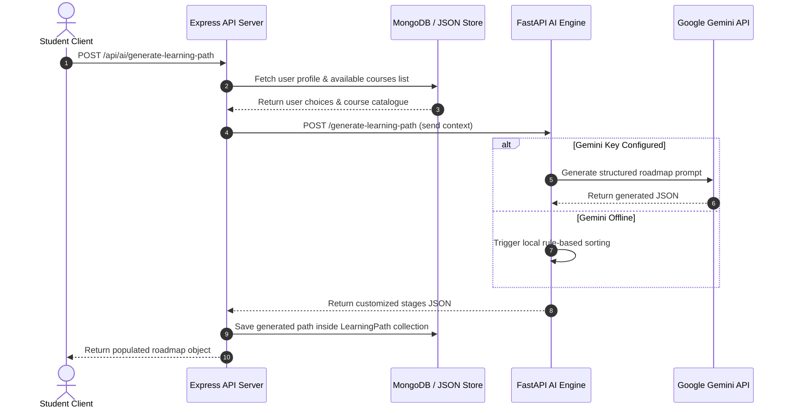
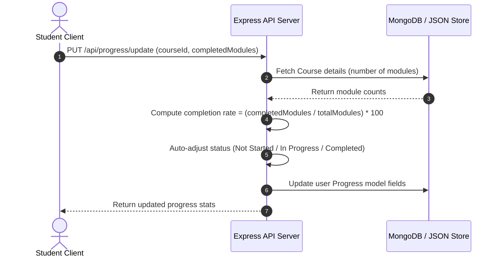

# Workflow Diagrams - AI LMS Automation Engine

This document explains the workflows and algorithms running inside the AI LMS Automation Engine.

---

## 🧭 Workflow 1: Learning Path Generation

This flow initiates when a student completes their track selection details:

---

## 📝 Workflow 2: Progress Updates and Calculations

This flow updates student progress:

---

## 💬 Workflow 3: Chatbot Helper

This flow details how the chat assistant resolves messages:

1.  The student clicks a quick prompt or inputs a custom question.
2.  Axios submits a `POST /api/ai/chat` request to the backend.
3.  The backend pulls the user's current progress reports (enrolled courses, completion rates) to formulate context.
4.  The backend passes the user inquiry and progress summaries to the python AI microservice.
5.  If Gemini is configured, it calls the LLM with the context to generate a natural response.
6.  If Gemini is down, the local chatbot helper checks for keywords ("learn", "progress", "course") to provide immediate, context-aware study tips.
